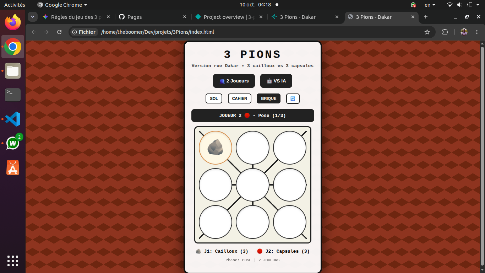
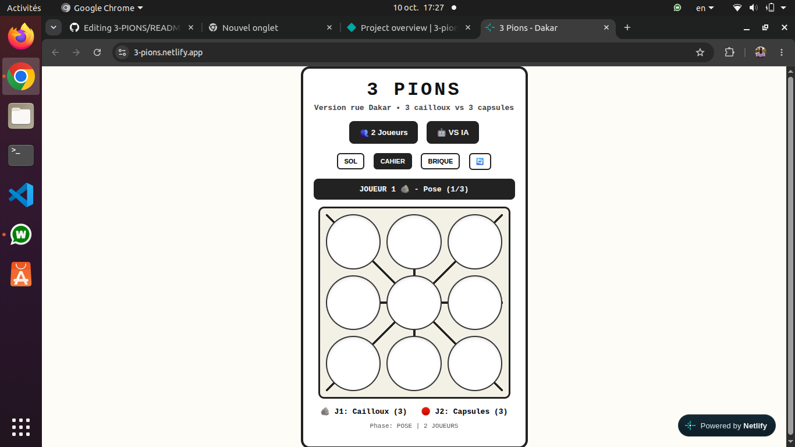
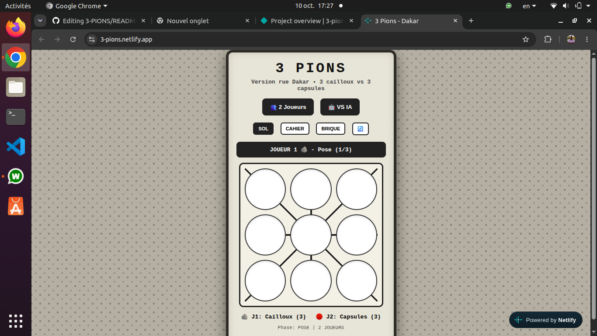

# 3 PIONS - Version Rue Dakar 🪨

Jeu traditionnel sénégalais 3 cailloux vs 3 capsules, revisité web. Inspiré des parties jouées dans les rues de Dakar.

🔗 **Demo live:** https://assiaka98.github.io/3-PIONS/

### 📱 Screenshots

| Thème Brique (rue) | Thème Cahier (papier) |
| :---: | :---: |
|  |  |  |

### 🎮 Features
- 2 Joueurs + VS IA
- Règle locale respectée: 1er coup au centre interdit
- 3 thèmes graphiques: Sol béton, Cahier, Brique street
- 100% Vanilla JS - Responsive mobile-first

### 🛠️ Stack
HTML / CSS / JS - No framework

### 📖 Story
Valoriser un jeu de rue sénégalais en version digitale jouable offline.
